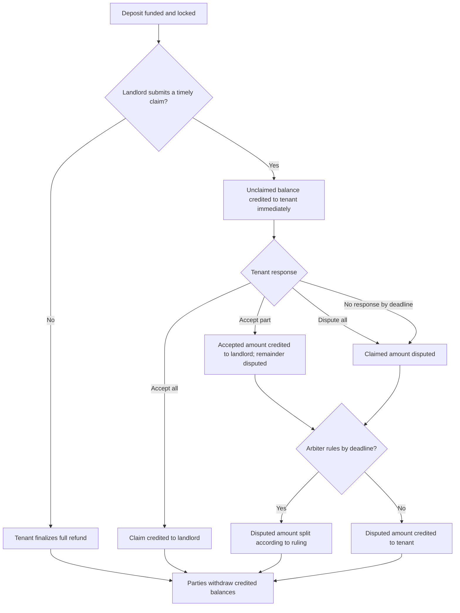

# OpenEscrow protocol flow

The Base Sepolia MVP is a single-token, shared-contract escrow with a designated arbiter fallback.

## Agreement setup

1. The landlord proposes the tenant, deposit amount, deadlines, and arbiter.
2. The arbiter accepts or declines the nomination.
3. A declined nomination must be replaced or the proposal cancelled.
4. Only after arbiter acceptance may the tenant approve the token transfer and fund.

## End-of-tenancy flow

```mermaid
flowchart TD
    A["Deposit funded and locked"] --> B{"Landlord submits a timely claim?"}
    B -->|No| C["Tenant finalizes full refund"]
    B -->|Yes| D["Unclaimed balance credited to tenant immediately"]
    D --> E{"Tenant response"}
    E -->|Accept all| F["Claim credited to landlord"]
    E -->|Accept part| G["Accepted amount credited to landlord; remainder disputed"]
    E -->|Dispute all| H["Claimed amount disputed"]
    E -->|No response by deadline| H
    G --> I{"Arbiter rules by deadline?"}
    H --> I
    I -->|Yes| J["Disputed amount split according to ruling"]
    I -->|No| K["Disputed amount credited to tenant"]
    C --> L["Parties withdraw credited balances"]
    F --> L
    J --> L
    K --> L
```

## Core protections

- Tenant silence never approves a landlord claim.
- The landlord cannot increase a submitted claim.
- The arbiter cannot award more than the disputed balance.
- Replacement cannot extend the ruling deadline.
- No administrator can redirect funds.
- Each agreement has independent accounting.
- Onchain evidence is a public commitment, not private document storage.

## What the protocol does not establish

The contract does not prove:

- The tenancy ended.
- The landlord's deduction is legally permitted.
- Evidence is authentic or complete.
- The selected deadlines comply with local law.
- The arbiter is licensed, neutral, or legally authorized.
- A blockchain-held deposit satisfies applicable custody requirements.

Those questions must be resolved for one selected jurisdiction before any real-money use.
