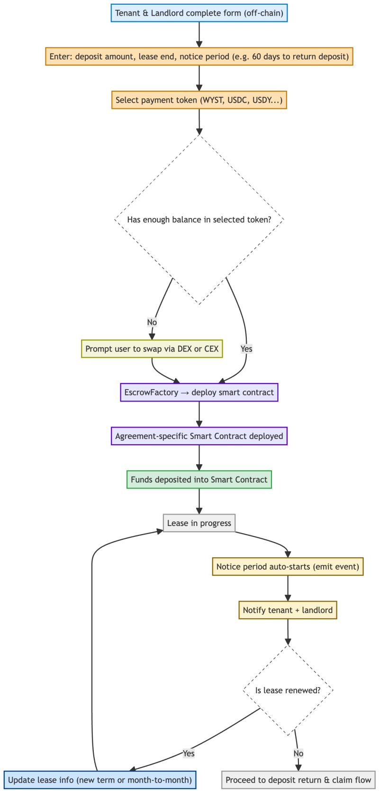
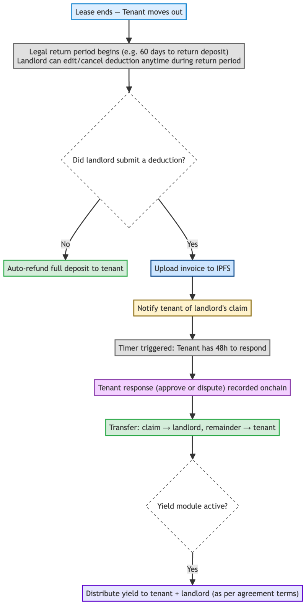

# OpenEscrow – Full Protocol Flow

This document provides a complete overview of the OpenEscrow deposit lifecycle, as implemented in the protocol and visualized through system wireframes.  
It outlines all state transitions — from escrow setup and lease management to deductions, disputes, and optional yield distribution.

---

## Visual Overview

| Escrow Setup & Lease Lifecycle | Deposit Return, Claims & Yield Flow |
|-------------------------------|--------------------------------------|
|  |  |

---

## Flow Summary

1. **Connection & Agreement Setup**  
   Tenant and landlord complete an off-chain form specifying the deposit amount, lease end date, and notice period (e.g. 60 days for deposit return).

2. **Token Check (WYST, USDC, USDY...)**  
   The app checks the tenant's balance in the selected token.  
   If insufficient, the user is prompted to swap via DEX or CEX.  
   Once confirmed, the `EscrowFactory` deploys a **dedicated smart contract** for the agreement.

3. **Escrow Creation**  
   The tenant deposits funds into the agreement-specific contract.  
   The lease is now considered **in progress**.

4. **Lease Lifecycle**  
   - If the lease is renewed (new term or month-to-month), details are updated and the contract continues.  
   - If not, the **notice period auto-starts**, and the protocol emits `NoticePeriodStarted`.  
     Both parties are notified.

5. **Deduction Flow**  
   During the legal return window (e.g. 60 days):  
   - If the landlord submits **no deduction**, the full deposit is refunded automatically to the tenant.  
   - If a **deduction is submitted**, an invoice must be uploaded to IPFS and the tenant is notified.

6. **Claim & Dispute Phase**  
   The tenant has **48h** to respond (approve or dispute).  
   The landlord may edit or cancel the claim at any time during this period.  
   The tenant's response is recorded onchain but does **not** block execution.

7. **Fund Release & Yield**  
   After the timer:  
   - The **claimed amount** is transferred to the landlord  
   - The **remainder** goes to the tenant  
   - If the yield module is active, **yield is distributed** according to the terms of the agreement

---

## Visual Conventions

To enhance readability, the diagrams use consistent **color coding and shape styles** to represent different types of actions, roles, and logic paths:

| Style | Meaning | Visual Example |
|-------|---------|----------------|
| 🟦 **Blue box** | User roles or off-chain actions (e.g. form input, tenant move-out) | `Tenant & Landlord complete form` |
| 🟧 **Orange box** | User inputs or contract parameters (e.g. token, lease duration) | `Enter: deposit amount...` |
| 🟨 **Yellow box** | Notifications or prompts shown to users | `Notify tenant + landlord` |
| 🟪 **Purple box** | Onchain contract interactions or transactions | `EscrowFactory → deploy smart contract` |
| 🟩 **Green box** | Automatic protocol outcomes (e.g. refund, passive flow) | `Auto-refund full deposit` |
| ⬛ **Gray box** | Process steps or internal logic | `Timer triggered: Tenant has 48h to respond` |
| 🟫 **Brown box** | Legal durations or procedural windows | `Legal return period begins` |
| 🟪 *Light violet box* | Onchain logs or blockchain-recorded events | `Tenant response recorded onchain` |
| ⯁ **Dashed diamond** | Decision logic or branching condition | `Is lease renewed?` |

These conventions help visually separate **who does what**, what is **onchain vs offchain**, and which parts of the process are **passive, automatic, or decision-based**.

---

For technical details, see [`technical-overview.md`](./technical-overview.md)  
For contributor instructions, see [`CONTRIBUTING.md`](../CONTRIBUTING.md)
