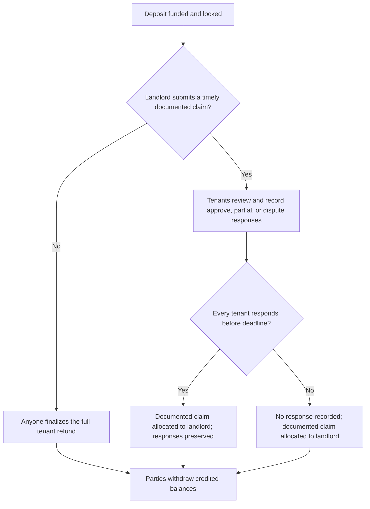

# OpenEscrow protocol flow

The Base Sepolia MVP is a shared-contract rental-deposit record with two explicit claim modes. The default public flow has no arbiter and treats tenant responses as part of a standardized shared record. An agreement created with a mutually accepted arbiter uses the optional dispute workflow.

## Agreement setup

1. The landlord proposes tenants, deposit shares, deadlines, and whether an optional arbiter is named.
2. Every tenant accepts the current terms. A named arbiter must also accept before finalization.
3. The finalized agreement becomes active after every tenant funds their assigned share.

## Default no-arbiter end-of-tenancy flow

```mermaid
flowchart TD
    A["Deposit funded and locked"] --> B{"Landlord submits a timely documented claim?"}
    B -->|No| C["Anyone finalizes the full tenant refund"]
    B -->|Yes| D["Tenants review and record approve, partial, or dispute responses"]
    D --> E{"Every tenant responds before deadline?"}
    E -->|Yes| F["Documented claim allocated to landlord; responses preserved"]
    E -->|No| G["No response recorded; documented claim allocated to landlord"]
    C --> H["Parties withdraw credited balances"]
    F --> H
    G --> H
```

Tenant silence is neither approval nor a dispute. It is recorded as **No response**. The contract does not decide whether a landlord's documented deduction is legally valid; it produces a shared record and deterministic test-token allocation.

When parties select the yield-test asset, the agreement keeps fixed taUSDC shares until a terminal
outcome. It then converts the full position to its deterministic testUSDC-equivalent demo value,
pays the landlord no more than the principal-denominated documented claim, and allocates the
remaining principal plus all positive demo yield to tenants. The separate operations reserve is
fully returned in the original agreement token because the MVP does not yet meter actual costs.

## Optional arbiter-backed flow

When the agreement names an arbiter who accepts before funding, an amount tenants do not accept enters the fixed dispute period. The arbiter may allocate no more than that disputed amount. If no ruling is recorded by the deadline, the disputed test-token amount is allocated to the tenant side.

## Core protections

- Tenant responses and non-responses remain distinguishable in the record.
- The landlord cannot increase a submitted claim.
- An optional arbiter cannot award more than the disputed balance.
- Arbiter replacement cannot extend the ruling deadline.
- No administrator can redirect funds.
- Each agreement has independent accounting.
- Onchain evidence is a public commitment, not private document storage.

## What the protocol does not establish

The contract does not prove:

- The tenancy ended.
- The landlord's deduction is legally permitted.
- Evidence is authentic or complete.
- The selected deadlines comply with local law.
- An optional arbiter is licensed, neutral, or legally authorized.
- A blockchain-held deposit satisfies applicable custody requirements.

Those questions require legal, security, and jurisdiction-specific review before any real-money use.
