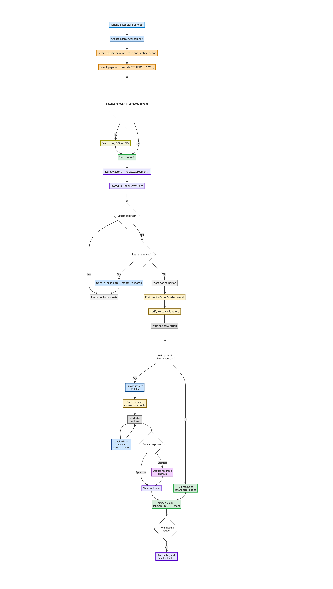

# OpenEscrow – Full Protocol Flow

This document provides a complete overview of the OpenEscrow deposit lifecycle, as implemented in the protocol and reflected in the system wireframe.  
It covers every state transition, from agreement creation to lease expiry, deduction claims, dispute handling, and yield distribution.

---

## Diagram – Full Lifecycle (Visual)

---

## Flow Summary (Written)

1. **Connection & Agreement Setup**  
   Tenant and landlord connect to the app and create an escrow agreement by entering the deposit amount, lease end date, and notice period duration.

2. **Token Check (WYST, USDC, etc.)**  
   Before depositing, the app checks if the user has enough balance in the selected token. If not, they're prompted to swap via a DEX or CEX. Once funds are available, the deposit is submitted to the smart contract.

3. **Escrow Creation**  
   Calling `createAgreement()` in the EscrowFactory creates a new agreement, stored in `OpenEscrowCore`.

4. **Lease Expiry Logic**  
   If the lease is renewed, the agreement is updated (new end date or month-to-month). If not, a notice period starts automatically.

5. **Deduction Flow**  
   At the end of the notice period, the landlord can either:
   - Submit no claim → full refund to tenant  
   - Submit a claim → IPFS invoice required, tenant is notified

6. **Claim & Dispute Phase**  
   Tenant has 48h to approve or dispute. The landlord can cancel or modify the claim during this time. Disputes are recorded onchain but don’t block execution.

7. **Fund Release & Yield**  
   Funds are split: claimed amount to landlord, remainder to tenant. If yield is enabled, it is distributed according to the configured share.

---

For technical details, see [`technical-overview.md`](./technical-overview.md).  
For contributor instructions, see [`CONTRIBUTING.md`](../CONTRIBUTING.md).
