# OpenEscrow technical overview

This document describes the implemented Base Sepolia MVP. The earlier factory, viewer, rules-module, and yield-module architecture has been retired.

## Components

### `OpenEscrow.sol`

One non-upgradeable contract holds many independent agreements in a mapping keyed by monotonically increasing IDs.

The contract has:

- Two immutable, allowlisted test-token addresses: plain testUSDC and taUSDC yield-test shares
- No owner or administrator
- No proxy or upgrade path
- No fee deducted from or accounted as part of the escrowed deposit
- No external rules module or production yield integration; deterministic test-yield settlement is built into the testnet contracts
- Per-agreement landlord, tenant, and arbiter roles
- Pull-based tenant and landlord withdrawals

### `OperationsReserve.sol`

New proposals disclose a separate, fixed 5 testUSDC pilot reserve. The tenant pays it to the
`OperationsReserve` contract before funding, and the payment produces its own onchain receipt.
It is not held by `OpenEscrow`, is not security-deposit principal, and can never become part of a
landlord deduction claim. Because the current MVP does not meter actual costs, it remains a fully
refundable tenant liability and is returned in the original agreement token at terminal withdrawal.
The testnet amount models sponsored Base transactions, retries, and encrypted document-storage
costs; it is not a validated production price.

### `AgreementActivityRegistry.sol`

This separate, no-custody contract is bound to the active `OpenEscrow` deployment. The landlord,
tenant, or current arbiter may independently anchor the SHA-256 hash of a canonical agreement
record or publish a typed activity hash. It stores no names, emails, notes, document pointers, or
evidence content, and it cannot move escrowed funds. An anchor proves that a party wallet attested
to exact bytes at a particular block time; it does not prove the underlying content is true or
legally sufficient.

The finalized-agreement dashboard can also build a versioned activity envelope in the browser,
hash it with `keccak256`, and publish only that hash as a note, document receipt, formal notice, or
decision receipt. The readable content is never sent to the server; the user can download a private
JSON proof that can later reproduce the public hash. Registry receipts are polled into both the
agreement dashboard and the wallet-scoped notification bell. The D1 record stores only the
activity type, content hash, and transaction receipt so the printable timeline can reference the
onchain action without retaining the private plaintext. The dashboard can verify a downloaded
proof locally by reconstructing the canonical envelope, recomputing its hash, and confirming the
matching registry event in the referenced Base Sepolia transaction.

### Frontend

The React frontend talks directly to Base Sepolia through wagmi and viem. It stores tracked agreement IDs in the browser and can discover agreements by scanning bounded event-log ranges from the deployment block. Saved proposal activity refreshes automatically, and notification read state is kept locally per connected account.

The hosted Worker also runs a confirmation-delayed, bounded Base Sepolia indexer on the fifteen-minute schedule. It reconciles lifecycle events to one exact finalized D1 record, feeds both the shared activity timeline and opted-in email delivery, and exposes cursor/backlog health through readiness. It does not infer identity from public wallet activity.

## State machine

```mermaid
stateDiagram-v2
    [*] --> Proposed: landlord proposes
    Proposed --> ReadyToFund: required parties accept
    Proposed --> Proposed: arbiter declines / landlord renominates
    Proposed --> Cancelled: landlord cancels
    ReadyToFund --> Proposed: landlord renominates
    ReadyToFund --> Cancelled: landlord cancels
    ReadyToFund --> Active: tenant accepts and funds
    Active --> ClaimOpen: landlord submits timely claim
    Active --> Closed: no claim; tenant finalizes refund
    ClaimOpen --> ClaimOpen: landlord reduces claim once
    ClaimOpen --> Closed: no-arbiter responses complete or timeout recorded
    ClaimOpen --> Closed: arbiter-backed claim retracted or fully accepted
    ClaimOpen --> Disputed: arbiter-backed partial/full dispute or tenant timeout
    Disputed --> Closed: arbiter rules
    Disputed --> Closed: arbiter timeout
```



`Closed` and `Cancelled` are terminal. Withdrawals are available only in those terminal phases when
a party has a credited balance or a tenant has a refundable operations reserve.

## Funds accounting

For a plain testUSDC agreement:

```text
depositAmount =
    tenantWithdrawable +
    landlordWithdrawable +
    locked +
    withdrawn
```

For a yield-test agreement, the same share-denominated invariant applies before settlement. Terminal
settlement burns all escrowed taUSDC and records the actual deterministic testUSDC-equivalent value:

```text
settledValue = tenantWithdrawable + landlordWithdrawable + withdrawn
```

The landlord allocation is bounded by the principal claim; every positive difference between
`settledValue` and `depositAmount` is allocated only to tenants.

For the whole contract, the combined allowlisted test-token balances cover all live liabilities:

```text
testUSDC.balanceOf(OpenEscrow) + taUSDC.balanceOf(OpenEscrow) >=
    sum(tenantWithdrawable + landlordWithdrawable + locked)
```

The inequality is deliberate: anyone can send either test token directly to the contract, creating harmless excess balance that is not assigned to an agreement.

## Claims and evidence

A contract claim includes:

- Claimed amount
- Nonzero content hash
- Public URI or opaque pointer
- Caller-defined evidence type
- Timestamp
- Submitter address

The landlord may amend once, downward only, before the tenant responds. An amendment never resets the response deadline.

The app separately captures structured deduction line items in the D1 negotiation record and
printable report. It validates that their total equals the aggregate onchain claim amount. These
off-chain line items improve documentation but are not contract state and do not remove the need
for privacy-safe, legally sufficient supporting evidence.

The contract cannot determine whether evidence is truthful or legally sufficient. In the default no-arbiter flow, it records the claim and tenant responses without adjudicating them. In an optional arbiter-backed agreement, evaluation remains that person's responsibility and, ultimately, a jurisdiction-specific legal question.

## Arbitration

- A nominated initial arbiter must accept before funding. An agreement created without an arbiter
  uses the record-only claim flow and does not enter `Disputed`.
- A declined nomination cannot later be accepted unless the landlord renominates.
- Post-funding replacement requires one party to propose, the other to confirm, and the candidate to accept.
- Replacement never extends a live ruling deadline.
- A resigned arbiter cannot rule.
- If no ruling is submitted by the deadline, the disputed amount becomes tenant-withdrawable.

## Security model

The contracts use OpenZeppelin `SafeERC20` and `ReentrancyGuard`. Escrow token calls occur during
funding, deterministic test-yield settlement, and withdrawal; the separate operations-reserve
contract holds and refunds the testnet reserve. Treasury withdrawal cannot consume the
tenant-refund liability.

The primary residual risks are:

- Wrong or malicious arbiter rulings
- Lost role wallets
- Inappropriate deadline configuration
- Sensitive content exposed through public evidence URIs
- Jurisdictional noncompliance
- Undiscovered implementation defects

See [`security-review.md`](security-review.md) and [`open-questions.md`](open-questions.md).

## Deployment

Deployment scripts live in [`../script`](../script). Frontend addresses and the deployment block live in [`../frontend/src/contracts/config.ts`](../frontend/src/contracts/config.ts).

Any source change to the contract requires a new deployment. Existing agreements stay on the previous immutable deployment.
