# OpenEscrow technical overview

This document describes the implemented Base Sepolia MVP. The earlier factory, viewer, rules-module, and yield-module architecture has been retired.

## Components

### `OpenEscrow.sol`

One non-upgradeable contract holds many independent agreements in a mapping keyed by monotonically increasing IDs.

The contract has:

- One immutable ERC-20 token address
- No owner or administrator
- No proxy or upgrade path
- No fee deducted from or accounted as part of the escrowed deposit
- No external rules or yield module
- Per-agreement landlord, tenant, and arbiter roles
- Pull-based tenant and landlord withdrawals

### `OperationsReserve.sol`

New proposals disclose a separate, fixed 5 testUSDC pilot reserve. The tenant pays it to the
`OperationsReserve` contract before funding, and the payment produces its own onchain receipt.
It is not held by `OpenEscrow`, is not refundable deposit principal, and can never become part of a
landlord deduction claim. The testnet amount is intended to model sponsored Base transactions,
retries, and encrypted document-storage costs; it is not a validated production price.

### `AgreementActivityRegistry.sol`

This separate, no-custody contract is bound to the active `OpenEscrow` deployment. The landlord,
tenant, or current arbiter may independently anchor the SHA-256 hash of a canonical agreement
record or publish a typed activity hash. It stores no names, emails, notes, document pointers, or
evidence content, and it cannot move escrowed funds. An anchor proves that a party wallet attested
to exact bytes at a particular block time; it does not prove the underlying content is true or
legally sufficient.

### Frontend

The React frontend talks directly to Base Sepolia through wagmi and viem. It stores tracked agreement IDs in the browser and can discover agreements by scanning bounded event-log ranges from the deployment block.

This is acceptable for a small testnet demonstration. A pilot-ready version needs an indexer and notification service.

## State machine

```mermaid
stateDiagram-v2
    [*] --> Proposed: landlord proposes
    Proposed --> ReadyToFund: arbiter accepts
    Proposed --> Proposed: arbiter declines / landlord renominates
    Proposed --> Cancelled: landlord cancels
    ReadyToFund --> Proposed: landlord renominates
    ReadyToFund --> Cancelled: landlord cancels
    ReadyToFund --> Active: tenant accepts and funds
    Active --> ClaimOpen: landlord submits timely claim
    Active --> Closed: no claim; tenant finalizes refund
    ClaimOpen --> ClaimOpen: landlord reduces claim once
    ClaimOpen --> Closed: claim retracted or fully accepted
    ClaimOpen --> Disputed: partial/full dispute or tenant timeout
    Disputed --> Closed: arbiter rules
    Disputed --> Closed: arbiter timeout
```



`Closed` and `Cancelled` are terminal. Withdrawals remain available whenever a party has a nonzero credited balance.

## Funds accounting

For every funded agreement:

```text
depositAmount =
    tenantWithdrawable +
    landlordWithdrawable +
    locked +
    withdrawn
```

For the whole contract:

```text
token.balanceOf(OpenEscrow) >=
    sum(tenantWithdrawable + landlordWithdrawable + locked)
```

The inequality is deliberate: anyone can send the token directly to the contract, creating harmless excess balance that is not assigned to an agreement.

## Claims and evidence

A claim includes:

- Claimed amount
- Nonzero content hash
- Public URI or opaque pointer
- Caller-defined evidence type
- Timestamp
- Submitter address

The landlord may amend once, downward only, before the tenant responds. An amendment never resets the response deadline.

The contract cannot determine whether evidence is truthful or legally sufficient. That remains the arbiter's responsibility and, ultimately, a jurisdiction-specific legal question.

## Arbitration

- A nominated initial arbiter must accept before funding. If the agreement is created without an
  arbiter, it may fund immediately and the parties can mutually appoint one if a dispute occurs.
- A declined nomination cannot later be accepted unless the landlord renominates.
- Post-funding replacement requires one party to propose, the other to confirm, and the candidate to accept.
- Replacement never extends a live ruling deadline.
- A resigned arbiter cannot rule.
- If no ruling is submitted by the deadline, the disputed amount becomes tenant-withdrawable.

## Security model

The contracts use OpenZeppelin `SafeERC20` and `ReentrancyGuard`. The core escrow token calls occur
only during funding and withdrawal; the separate operations-reserve contract handles only reserve
collection and treasury withdrawal.

The primary residual risks are:

- Wrong or malicious arbiter rulings
- Lost role wallets
- Inappropriate deadline configuration
- Sensitive content exposed through public evidence URIs
- Jurisdictional noncompliance
- Undiscovered implementation defects

See [`security-review.md`](security-review.md) and [`open-questions.md`](open-questions.md).

## Deployment

Deployment scripts live in [`../script`](../script). Frontend addresses and the deployment block live in [`../frontend/src/contracts/config.ts`](../frontend/src/contracts/config.ts).

Any source change to the contract requires a new deployment. Existing agreements stay on the previous immutable deployment.
